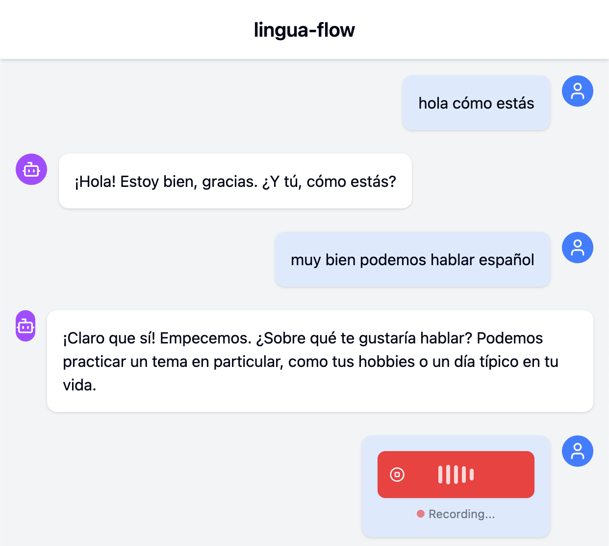

# lingua-flow



## Overview
Chat with an AI Spanish language tutor.

Built with Python (FastAPI, OpenAI, Deepgram) and TypeScript (Vite, React, Tailwind CSS).

## Setup

Create a file called `lingua-flow/backend/.env` with the necessary API keys:
```bash
DEEPGRAM_API_KEY=YOUR_KEY_HERE # https://console.deepgram.com/
OPENAI_API_KEY=YOUR_KEY_HERE # https://platform.openai.com/
```

Setup and run the backend (FastAPI server)
```bash
cd backend

./setup.sh

hatch shell
hatch run start
exit
```

Setup and run the frontend (React GUI)
```bash
cd frontend

npm install

npm run dev
```
